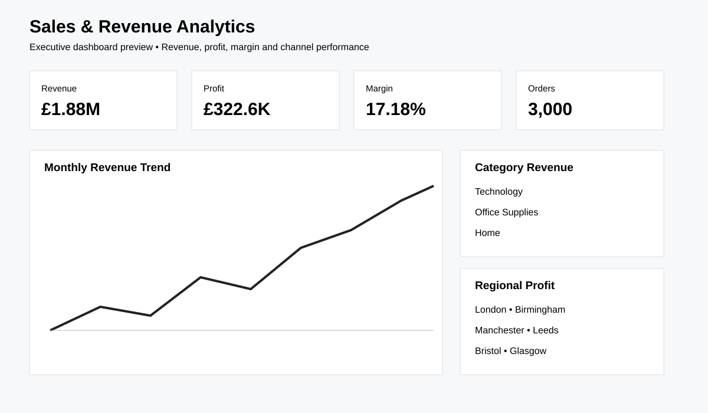

# Sales & Revenue Analytics

Portfolio-grade Data Analyst project using a synthetic UK retail dataset, Python, SQL and a Power BI dashboard specification.



## Key findings

- The portfolio model contains **3,000 orders** across six UK regions, three categories and three sales channels.
- Profitability is analysed alongside revenue, so high-sales segments can be separated from genuinely strong-margin segments.
- The analysis explicitly tests product, category, region, channel, time and discount effects before translating results into dashboard actions.

## Business problem
Analyse sales and profitability across products, categories, regions and channels to identify revenue drivers and areas for improvement.

## Tools
- Python: pandas, NumPy, Matplotlib
- SQL: SQLite-compatible queries
- Power BI: dashboard design/specification

## Key results
- Total sales: **£2,277,461.02**
- Total profit: **£397,729.15**
- Overall profit margin: **17.46%**
- Orders: **3,000**
- Customers: **448**
- Average order value: **£759.15**

## Key questions
- What are total sales, profit, margin, orders and average order value?
- How does sales performance change over time?
- Which categories, regions, products and channels drive revenue?
- Which areas generate the strongest profit?
- How do discount levels relate to profitability?

## Dataset
Synthetic UK retail sales data covering January 2024 to December 2025. The full dataset is generated reproducibly with `src/generate_data.py`.

## Project structure
```text
01-sales-revenue-analysis/
├── README.md
├── data/
├── requirements.txt
├── sql/
├── src/
├── dashboard/
├── reports/
└── visuals/
```

## Run locally
```bash
pip install -r requirements.txt
python src/generate_data.py
python src/analyze.py
```

The analysis script validates the data and exports KPI and performance tables to `outputs/`.

## Portfolio note
The dataset is synthetic and exists for portfolio demonstration. Findings must not be interpreted as real company performance.
