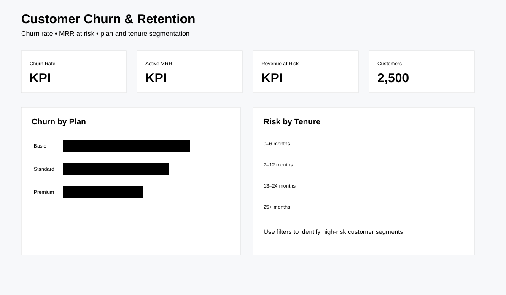

# Customer Churn & Retention Analysis

Portfolio project analysing customer churn, retention and revenue risk for a subscription business.



## Key findings

- The model evaluates **2,500 customers** using tenure, plan, usage, support contacts and satisfaction.
- Churn is analysed by customer segment rather than only as a single headline rate, making retention risk easier to prioritise.
- Revenue-at-risk analysis connects customer churn to commercial impact instead of treating every churned account as equally valuable.

## Tools
Python (pandas, matplotlib), SQL (SQLite), Power BI-ready outputs.

## Business questions
- What is the churn rate and how does it vary by plan, tenure and acquisition channel?
- Which customer segments have the highest revenue at risk?
- What behaviours are associated with churn?
- Which retention actions should be tested first?

## Dataset
Synthetic, reproducible customer-level data generated by `src/generate_data.py`. It includes tenure, monthly charges, usage, support contacts, satisfaction and churn outcome.

## KPIs
Churn rate, active customers, monthly recurring revenue, revenue at risk, average tenure and retention by segment.

## Run
```bash
pip install -r requirements.txt
python src/generate_data.py
python src/analyze.py
```

The project is synthetic and is for portfolio demonstration only.
