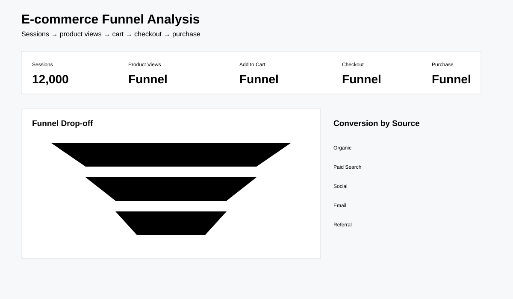

# E-commerce Funnel & Conversion Analysis

Analyse an online retail funnel from sessions through product views, carts, checkout and purchases.



## Key findings

- The synthetic model contains **12,000 sessions** across acquisition sources and device types.
- The analysis separates stage-to-stage conversion from overall conversion, making the largest funnel leak visible.
- Source and device segmentation shows where acquisition volume and conversion efficiency diverge, supporting more targeted optimisation.

## Tools
Python, SQL, Power BI-ready outputs.

## Questions
Where do users drop out? Which device and traffic source produce the strongest conversion? How much revenue is lost at each funnel stage?

## KPIs
Sessions, product views, add-to-cart rate, checkout rate, purchase conversion and revenue.

## Run
```bash
pip install -r requirements.txt
python src/generate_data.py
python src/analyze.py
```

Synthetic dataset; portfolio use only.
