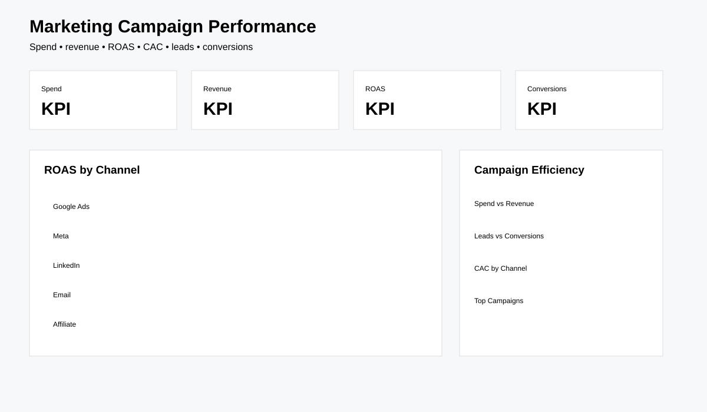

# Marketing Campaign Performance Analysis

Evaluate campaign spend, leads, conversions, revenue and return on ad spend across channels.



## Key findings

- The synthetic dataset contains **800 campaigns** across Google Ads, Meta, LinkedIn, Email and Affiliate channels.
- ROAS and CAC are analysed together so efficient revenue generation is not confused with low acquisition cost alone.
- Campaign-level analysis highlights the difference between channel averages and individual campaign performance, supporting budget-review decisions.

## Tools
Python, SQL, Power BI-ready outputs.

## Questions
Which campaigns generate efficient revenue? Which channels have high spend but weak conversion? What is CAC and ROAS by campaign?

## KPIs
Spend, impressions, clicks, leads, conversions, revenue, ROAS and CAC.

## Run
```bash
pip install -r requirements.txt
python src/generate_data.py
python src/analyze.py
```

Synthetic dataset; portfolio use only.
