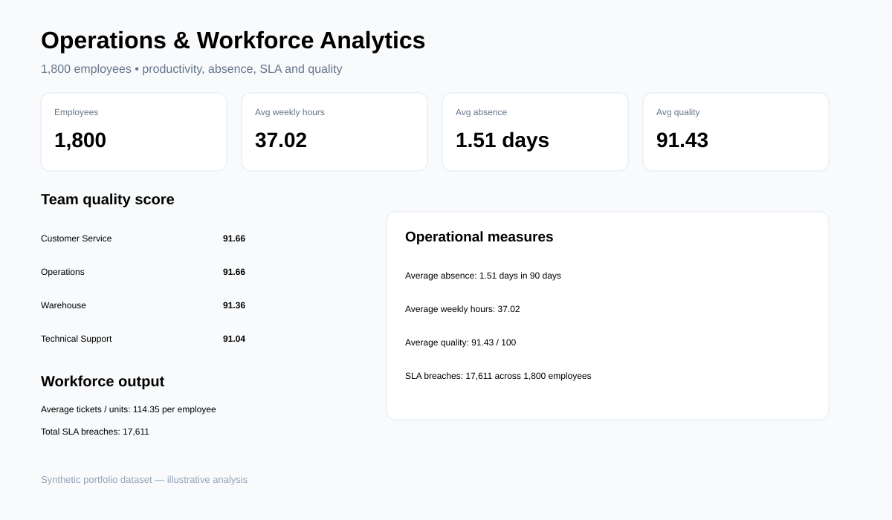

# Operations & Workforce Analytics

Analyse staffing levels, hours, absence, productivity and service performance to identify operational bottlenecks.



## Key findings

- The model evaluates **1,800 employees** across Customer Service, Warehouse, Operations and Technical Support.
- Output is analysed alongside weekly hours, absence, SLA breaches and quality rather than using headcount alone.
- Team and shift scorecards make it possible to identify where productivity and service performance diverge.

## Tools
Python, SQL, Power BI-ready outputs.

## Questions
Which teams are understaffed? How do overtime and absence relate to output? Where are service-level breaches concentrated?

## KPIs
Headcount, weekly hours, absence days, output, SLA breaches and quality score.

## Run
```bash
pip install -r requirements.txt
python src/generate_data.py
python src/analyze.py
```

Synthetic dataset; portfolio use only.
