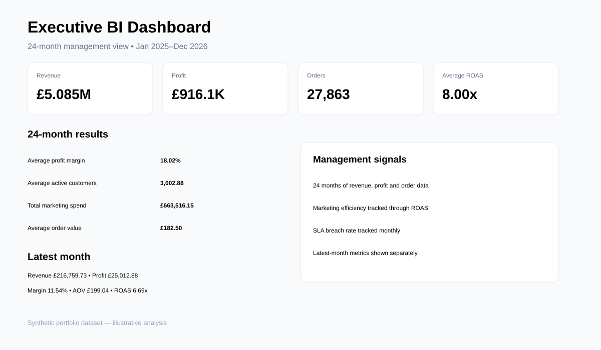

# Executive Business Intelligence KPI Dashboard

A reusable executive KPI model combining sales, customers, marketing and operations concepts into one management dashboard.



## Key findings

- The model provides **24 months** of executive KPI history, linking revenue, profit, customers, orders, marketing spend and service performance.
- Derived KPIs such as profit margin, average order value and ROAS turn raw measures into management-ready indicators.
- The dashboard is designed to move from headline performance to trend, customer activity, marketing efficiency and SLA risk without overwhelming the executive view.

## Tools
Python, SQL, Power BI design.

## Purpose
Translate operational data into a concise executive view: revenue, profit, customers, conversion, marketing efficiency and service performance.

## KPIs
Revenue, profit, profit margin, orders, average order value, active customers, marketing spend, ROAS and SLA breach rate.

## Run
```bash
pip install -r requirements.txt
python src/generate_data.py
python src/analyze.py
```

Synthetic dataset; portfolio use only.
