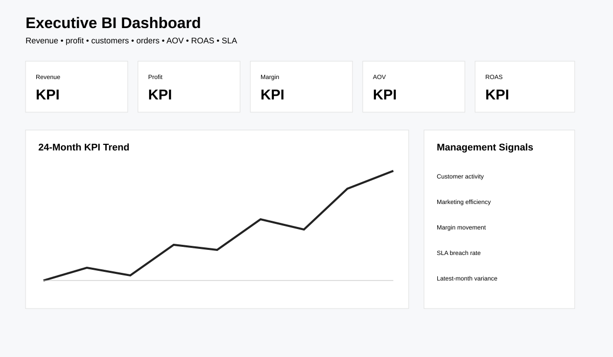

# Data Analyst Portfolio — Kushagra Panchal

A six-project analytics portfolio built around realistic business questions, reproducible synthetic data, SQL, Python/pandas and BI dashboard design.

> **Two-repository portfolio:** this repo uses reproducible synthetic business datasets. See also the [Real-World UK Data Analyst Portfolio](https://github.com/kushagra8403/real-data-analyst-portfolio) using genuine UK public-sector data.

> **Core workflow:** Business question → data quality → SQL/Python analysis → KPI → dashboard → business recommendation.

## Dashboard previews

## Projects

| # | Project | Business focus | Tools |
|---|---|---|---|
| 01 | [Sales & Revenue Analytics](./01-sales-revenue-analysis/) | Revenue, profit, products, regions and channels | Excel, SQL, Python, Power BI |
| 02 | [Customer Churn & Retention](./02-customer-churn-analysis/) | Churn, retention segments and revenue at risk | SQL, Python, Power BI |
| 03 | [E-commerce Funnel Analysis](./03-ecommerce-funnel-analysis/) | Funnel drop-off, acquisition and device conversion | SQL, Python, Power BI |
| 04 | [Marketing Campaign Performance](./04-marketing-campaign-analysis/) | Spend, leads, conversions, ROAS and CAC | SQL, Python, Power BI |
| 05 | [Operations & Workforce Analytics](./05-operations-workforce-analysis/) | Staffing, output, absence, SLA and quality | SQL, Python, Power BI |
| 06 | [Executive BI Dashboard](./06-executive-bi-dashboard/) | Executive KPI trends across commercial and operational performance | SQL, Python, Power BI |

## What this portfolio demonstrates

- Data cleaning, validation and reproducible synthetic-data generation
- SQL aggregation, segmentation, CTEs and window-function analysis
- Python/pandas exploratory analysis and KPI calculation
- Revenue, margin, churn, conversion, ROAS, CAC, SLA and workforce metrics
- Business-focused findings and recommendation writing
- Power BI dashboard planning and executive KPI storytelling
- Automated checks with GitHub Actions
- Recruiter-friendly documentation, notebooks and reusable project structure

## Reproducibility

Each project contains a data generator with a fixed random seed. Generated datasets are intentionally kept out of Git history where practical, so the portfolio stays lightweight while remaining reproducible.

## Quality checks

GitHub Actions runs portfolio checks on pushes and pull requests. See [`portfolio-checks.yml`](./.github/workflows/portfolio-checks.yml).

## Supporting portfolio material

- [Portfolio overview](./PORTFOLIO.md)
- [CV project descriptions](./CV_PROJECT_DESCRIPTIONS.md)
- [CV project bullets](./CV_PROJECT_BULLETS.md)
- [LinkedIn project descriptions](./LINKEDIN_PROJECT_DESCRIPTIONS.md)
- [Customer churn notebook](./analysis-notebooks/customer_churn_analysis.ipynb)

**Author:** Kushagra Panchal — Aspiring Data Analyst
